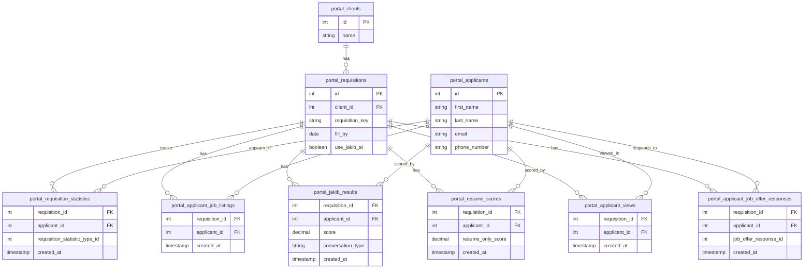
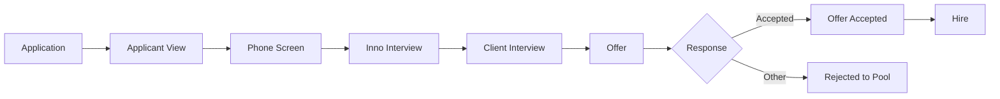

# Requisition Application Progress Data Model

This document describes the data structure for the Requisition Application Progress model in Metabase.

**Metabase URL:** https://innosource.metabaseapp.com/model/305-requisition-application-progress

## Entity Relationship Diagram

## Data Flow

The model tracks applicant progression through the recruitment pipeline:

## Statistic Type IDs

The `portal_requisition_statistics.requisition_statistic_type_id` field tracks different stages:

- **2** = Phone Screen
- **3** = Interview (Inno)
- **4** = Client Interview
- **5** = Offer
- **7** = Rejected to Regional Pool
- **8** = Offer Accepted

## AI Scoring Categories

Applicants are categorized based on AI scores:

| Category | Jakib Score | Resume Only Score |
|----------|-------------|-------------------|
| GREEN    | > 86        | > 81              |
| YELLOW   | > 67        | > 57              |
| RED      | >= 0        | >= 0              |
| NONE     | null        | null              |

## Key Metrics

The final output includes:
- Client and requisition details
- Applicant information and contact details
- AI scores (Jakib and resume-only)
- AI category and method (MINNIE vs NO AI)
- Date progression through each recruitment stage
- Pre-score view flag (whether applicant was viewed before scoring)

## Filters

- Requisitions with `fill_by` year >= 2024
- Statistics with `created_at` year >= 2024
- Hires exclude offer response IDs: 2, 3, 4, 5, 6
